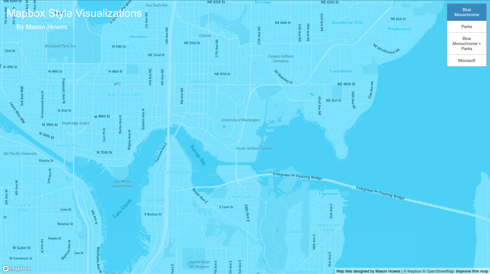
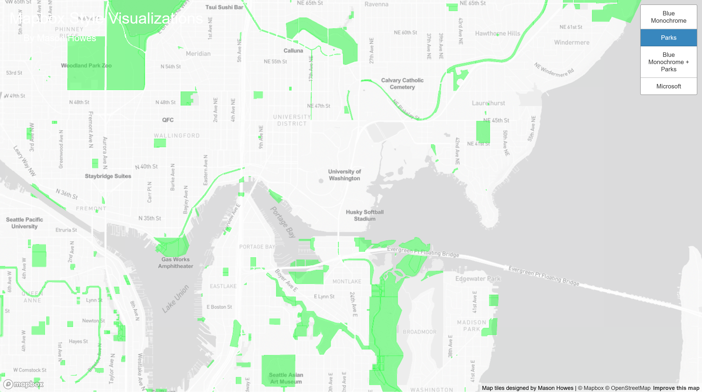
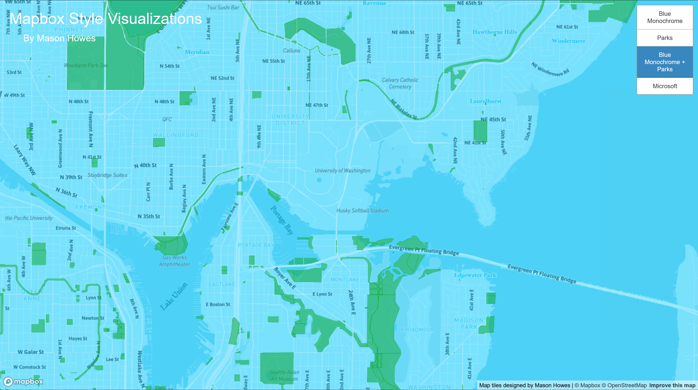
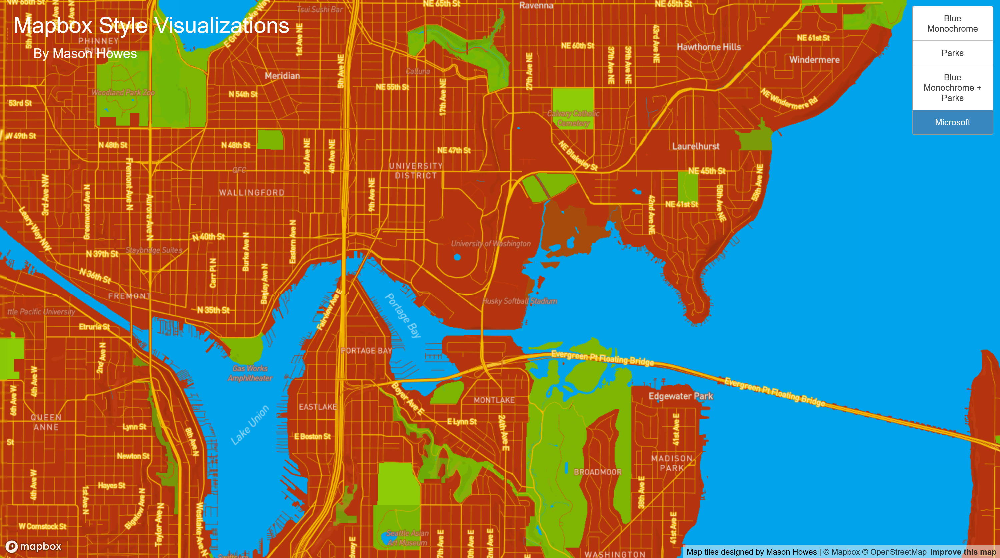

# Mapbox Style Visualization

Click [HERE](https://masonhowes.github.io/mapbox-tile-viz/) to view the different Maps in your web browser.

### Map 1 - Blue Monochrome

This map examines the Geographic Area of North Seattle, focused on the University of Washington campus and the surrounding areas.

There exists 12 rendered zoom levels for this map, between zoom level 14 and zoom level 3.

For this map, I decided to use the Mapbox default Blue Monochrome style, with some slight alternations on my end. The Mapbox default blue is more of a pastel blue, and in my alteration I increased the saturation of the blue color. On top of this, I edited the default fonts used for things such as Places and Bodies of Water. I chose the blue default because blue is my favorite color, and I felt it encapsulates the "rainy city" aesthetic of seattle nicely.

### Map 2 - Parks

GeoJSON data provided by [Seattle GeoData](https://data-seattlecitygis.opendata.arcgis.com/datasets/94e59cd6e7a6479c9131cc3eb40b29b8_2/explore?location=47.618842%2C-122.334385%2C14.00)

This map examines the Geographic Area of North Seattle, focused on the University of Washington campus and the surrounding areas.

There exists 12 rendered zoom levels for this map, between zoom level 14 and zoom level 3.

For this map, I used a GeoJSON dataset to highlight Park boundaries in the Seattle area. The map itself uses a basic white monochrome style provided by Mapbox. I made this choice so that the park boundaries (filled with green) are the forefront in terms of what the viewers attention will be drawn to.

### Map 3 - Blue Monochrome + Parks

This map examines the Geographic Area of North Seattle, focused on the University of Washington campus and the surrounding areas.

There exists 12 rendered zoom levels for this map, between zoom level 14 and zoom level 3.

For this map, I combined the two previous maps together into one visualization. This map uses the edited Blue Monochrome coloring as a base, and the Parks dataset to highlight the Seattle Park Boundaries in green. I believe this colorset works well together, as it replicates the Earth's colorscheme.

### Map 4 - Microsoft

This map examines the Geographic Area of North Seattle, focused on the University of Washington campus and the surrounding areas.

There exists 12 rendered zoom levels for this map, between zoom level 14 and zoom level 3.

For this map, I used the Mapbox "Style with image" option to stylee the map after Microsoft's colorscheme. I chose this theme because my parents giving me access to a Microsoft computer at a young age sparked my enthusiasm for technology, and got me to where I am today. I used the most fitting and visually pleasing colors for each geographic detail in order to make the map aesthetically pleasing to look at with the theme integrated.
